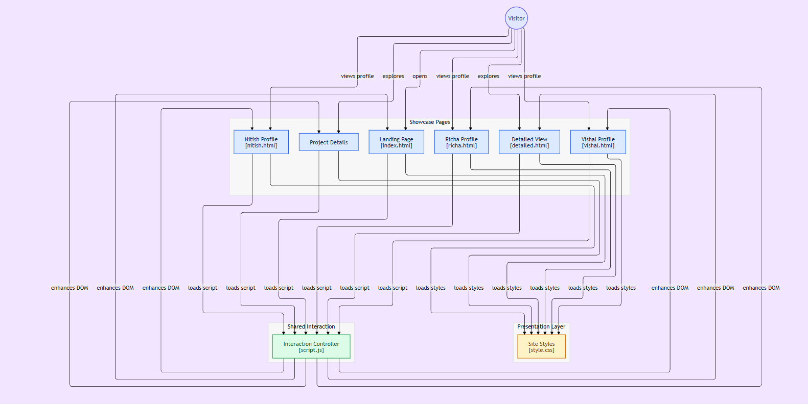

# CleanTech : Green Energy MRV (Measurement, Reporting Verification) Engine

A scalable infrastructure-as-a-service platform designed to automate verifiable net-zero compliance for the next generation of industrial energy grids.

View : https://project-details-view.vercel.app/

Last Updated : 18-09-2026 19:38